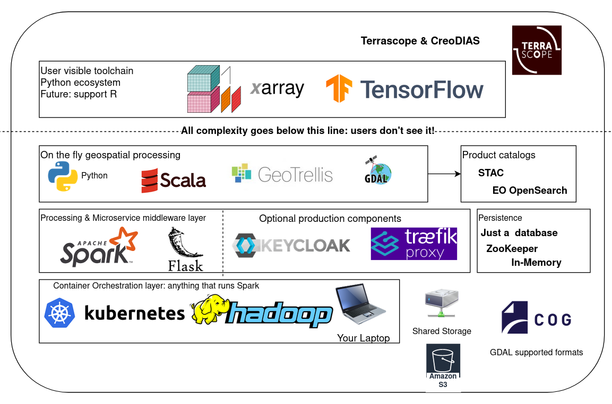

# openEO GeoPySpark Driver

This project implements a GeoPySpark powered [openEO](https://openeo.org/) backend.

It builds on [openeo-python-driver](https://github.com/Open-EO/openeo-python-driver) to take care of the
generic REST aspect of openEO
and leverages [GeoPySpark](https://github.com/locationtech-labs/geopyspark/)
and [GeoTrellis](https://geotrellis.io/) (through [openeo-geotrellis-extensions](https://github.com/Open-EO/openeo-geotrellis-extensions))
to handle the heavy duty geospatial (raster) processing.

See [docs/](./docs) for more information about requirements, configuration, development setup,
user facing features, etc.

## Technology stack

## Public endpoints

- VITO/Terrascope openEO backend: https://openeo.vito.be/openeo/
- Copernicus Data Space Ecosystem: https://openeo.dataspace.copernicus.eu/
