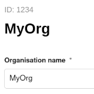

# Organization Id Based ETL Reporting


Data processing in openEO (both batch jobs and synchronous processing) consumes credits.
Advanced users can be member of multiple organizations,
each of which is associated with a separate credit balance.
Originally, users had to manually and globally switch the active organization under their account
to make sure the correct organization's credits were used for processing.

With [#671](https://github.com/Open-EO/openeo-geopyspark-driver/issues/671)
(openeo-geopyspark-driver version 0.53.0)
a feature was added to select the desired organization for a specific job through the job options:

```python
job = cube.create_job(
    ...,
    job_options={
        "etl_organization_id": 1234,
    },
)
```


To figure out the organization id (integer) of the desired organization:

1.  Log in to the marketplace portal corresponding to the openEO backend you are using, e.g.
    - [portal.terrascope.be](https://portal.terrascope.be/)
      for openEO Platform ([openeo.cloud](https://openeo.cloud))
      or the Terrascope/VITO openEO backend ([openeo.vito.be](https://openeo.vito.be/))
    - [marketplace-portal.dataspace.copernicus.eu](https://marketplace-portal.dataspace.copernicus.eu/)
      for the Copernicus Data Space Ecosystem (CDSE,
      [openeo.dataspace.copernicus.eu](https://openeo.dataspace.copernicus.eu/)
      or [openeofed.dataspace.copernicus.eu](https://openeofed.dataspace.copernicus.eu/))
2.  Go to your profile (URL path `/profile`) and switch to the desired organization under "Linked organisation"
    (make sure to press the "switch" button)
3.  Go to the "Organisation" tab (URL path `/profile/organisation`)
    and find the organization id, labeled "ID", above the organization name.
    For example, `1234` in the following screenshot:

    
