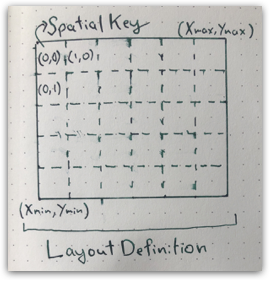
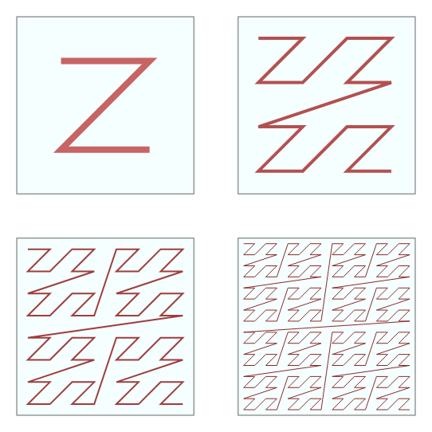

# Geotrellis openEO processing

This page describes some implementation details about the openEO processing based on Geotrellis.

## Overview

The core of the implementation is written in Scala, and can be found in the [openeo-geotrellis-extensions](https://github.com/Open-EO/openeo-geotrellis-extensions)
repository.

The following image shows the mapping between key openEO concepts, and classes in the implementation:


## General processing strategy

By design, the Geotrellis implementation relies on distributed processing via the [Apache Spark](https://spark.apache.org)
library. Spark gives us a framework to describe and execute distributed processing workflows that transform arbitrary collections
of objects. In Spark, these are called resilient distributed datasets, or RDDs.

Geotrellis is a framework that helps with representing georeferenced raster and vector data and also supports Spark.
Hence, the objects in our Spark collections (RDD), are key-value pairs where the key contains a timestamp and
a row and column in a spatial grid. The value is multiband raster tile. Such a tile contains chunks of a
fixed size, by default 256x256 pixels, for each band in the openEO data cube.

So let's take the example of an 'apply' process in openEO, with the process set to 'abs'. In
this case, Spark can simply apply the absolute value process to each 2D tile in parallel. If a chain of processes is applied,
Spark and Geotrellis functionality is used to make sure that this all happens as efficiently as possible.

An important feature of Spark is that intermediate results are kept in memory whenever possible and only spilled to disk
when needed. Writing to disk is entirely hidden for the actual processing workflow. This is quite different from more traditional
batch processing workflows that commonly write a lot of intermediate results to disk.

Other aspects covered by the combination of Spark and Geotrellis are complex operations such as merging data cubes, resampling
or applying functions over the complete timeseries for a given pixel. In these cases, it is often needed to reorganize the
the dataset in various ways. The Geotrellis openEO implementation tries to optimize all these cases.

For UDF's, where user-provided Python code is executed, we similarly reorganize the dataset, depending on what
spatiotemporal subset of the datacube can be processed in parallel. Then the data is converted into a Python XArray object
which is passed on to the user code for transformation.


## Data Cubes

The main openEO concept implemented by this library is the `Raster data cube`, which is a multi-dimensional array of raster data.

This library does not support arbitrary multidimensional cubes, but rather focuses on the type of cubes that are most
commonly encountered in earth observation. The most complex type that we can represent is the 4-dimensional space-time-bands cube.

This cube is mapped to a Geotrellis [`MultibandTileLayerRDD`](https://geotrellis.github.io/scaladocs/latest/geotrellis/spark/index.html#MultibandTileLayerRDD[K]=org.apache.spark.rdd.RDD[(K,geotrellis.raster.MultibandTile)]withgeotrellis.layer.Metadata[geotrellis.layer.TileLayerMetadata[K]])

For cubes with a temporal dimension, a `SpacetimeKey` is used, while spatial cubes use the `SpatialKey`.

Geotrellis documents this class and its associated metadata [here](https://geotrellis.readthedocs.io/en/latest/guide/core-concepts.html#layouts-and-tile-layers).

The key class describing the spatial layout of a cube is the `LayoutDefinition`, which combines an arbitrary spatial extent
with a regular tile grid (`TileLayout`). This also defines the pixel size, which is fixed for the entire cube.



To be able to understand how these cubes work and behave, or how to correctly manipulate them, knowledge of the [Spark RDD concept](https://spark.apache.org/docs/latest/rdd-programming-guide.html)
is essential. These are distributed datasets that (in production) live on multiple machines in a cluster, allowing openEO
to effectively scale out computations.


### Data cube loading: `load_collection` & `load_stac`

Loading large EO datasets into a Spark RDD is complex, mainly due to the variety in data formats, but also because
IO is often a performance & stability bottleneck. Depending on the characteristics of the underlying storage system, the
optimal loading strategy may also differ, which is why we support multiple code paths.

The main class for loading data from POSIX or Object Storage type of systems is the `FileLayerProvider`.

This `load_collection` implementation supports a number of features:

- *Resampling at load time*, improving both performance and correctness.
- Loading of *GDAL* supported formats
- Loading of Geotiff using a *native* implementation
- Applying *masks at load time*, reducing the amount of data to read
- Applying *polygonal filtering* at load time


### Data cube organization: partitioners

As mentioned, Spark will distribute data cubes over a cluster, into groups of data called `partitions`. A partition needs
to fit into memory for processing, so the size matters, and Spark is not able to know the optimal partitioning for any given problem.

Depending on procesess that are used, the optimal partitioning scheme can also change: for time series analysis, it would
be optimal to group data for the same location with multiple observations in the same group. For other processes, like `resample_spatial`,
it may be needed to have information from neighbouring tiles, so a grouping per observation would be more optimal.
As a rule of thumb it is up to the process to check the partitioner, and change it if needed.

Whenever a partitioner is changed, the data will be shuffled, which is a costly operation. This is why the code often tries
to cleverly avoid this where possible.

Assigning keys to partitions happens based on an indexing scheme. Usually, it is recommended to consider the spatiotemporal
nature of the data to select the optimal scheme. Geotrellis explains a few potential schemes [here](https://geotrellis.readthedocs.io/en/latest/guide/core-concepts.html#key-indexes).

The default scheme in openEO is the `Z-curve`. The 2D variant is shown below, for cubes with a time dimension, the 3D variant is used.



#### Sparse partitioners

Data cubes can be sparse because openEO supports operations on polygons, that are not necessarily spatially adjacent. Examples
include the use of `aggregate_spatial` on a vector cube or the `filter_spatial` process on a vector cube.

When this case occurs, regular Geotrellis spatial partitioners tend to create too many partitions, because they consider the
full bounding box instead of the more detailed geometry locations. The same can occur for data which is irregular in the temporal
dimension.

The effect of having too many partitions, is huge numbers of Spark tasks that do not do anything, but still consume resources as
they are nevertheless scheduled. This becomes especially noticeable when the actual work that needs to be done is small.

Sparse partitioners avoid this problem by determining all of the SpacetimeKeys up front. We also store the list of keys in
the partitioner itself, allowing certain operations to be implemented more efficiently.

## openEO processes

This library implements a large part of the openEO process specification, mainly by using Geotrellis functionality.

Depending on the type of process, the implementations can be found in 2 main locations: OpenEOProcesses and OpenEOProcessScriptBuilder.

`OpenEOProcesses` implements the Scala part of predefined processes that operate on full data cubes. This Scala code is usually
invoked by a Python counterpart in [`GeopysparkDataCube`](https://github.com/Open-EO/openeo-geopyspark-driver/blob/master/openeogeotrellis/geopysparkdatacube.py).
Some of this Scala code may be used by multiple openEO process implementations. For instance, openEO `reduce_dimension` and `apply_dimension` can in some cases
use the same code.

`OpenEOProcessScriptBuilder` supports openEO processes that operate on arrays of numbers, which are often encountered in
openEO `child processes`, as explained [here](https://api.openeo.org/#section/Processes/Process-Graphs). This part of the
work is not distributed on Spark, so operates on chunks of data that fit in memory. It does use Geotrellis which generally has
quite well performing implementations for most basic processes.


## Specific properties of the Geotrellis implementation

### Only up to 4D cubes supported

A Geotrellis cube has fixed dimensions, in this order: time, y, x, and bands. This does not prevent us from advertising
certain operations on dimensions at the metadata level, but does imply some limitations. In practice, this limitation has
little impact on most real-world use cases.

### The bands dimension is a single array

Bands are represented by a single array, and thus needs to fit in memory. Some applications require more than 100 bands,
and thus either need to increase memory, or decrease the chunk size.

## Tunables

The Geotrellis implementation has a number of tunables that can be used to configure a specific backend for an environment,
or that can be set per batch job. Most of them can be found in [`openeogeotrellis.config.config.GpsBackendConfig`](https://github.com/Open-EO/openeo-geopyspark-driver/blob/c0a949ac875ea3a983a1738d52aa1fb1af810a19/openeogeotrellis/config/config.py#L65).

- `tile_size` is the size in pixels of a single tile, as returned by `load_collection`. Large tiles benefit operations on spatial neighborhoods, but may require memory or cause jobs to fail.
Small tiles may create more overhead from parallellization or task scheduling.
- `executor_threads_jvm` is the number of worker threads given to the Java/Scala part of the processing. This only helps if operations effectively use parallel processing. In specific combinations it can cause crashes due to threading issues.
- GDAL has various caching related settings that may impact IO performance, but also increase memory usage throughout the lifetime of the job.

### Tunables at job level

A number of options can be configured via 'feature flags' on load_collection level. This allows a per-load_collection config.
These tunables allow to easily run performs experiments.
By default, the strategy should be for the backend to select the most optimal value dynamically or by configuring a fixed value
in the backend config.

There is not necessarily a single optimal value: for instance if a processing cluster has a high memory per cpu ratio, it
may be better to create larger partitions.

```python
cube = c.load_collection("SENTINEL2_L2A", bands=["B02","SCL"], max_cloud_cover=75)

temporal_partition_options = {
    "tilesize": 512
}

cube.result_node().update_arguments(featureflags=temporal_partition_options)

```

- `tilesize` e.g. 128, 256, 512
- `load_per_product` boolean, set to true to read all chunks of the same asset on a single executor
- `temporalresolution` can be `ByDay`, `ByMonth`, used to configure partitioner
- `indexreduction` usually between 3 and 10, a higher reduction reduces the number of partitions, so more memory per partition
- `no_resample_on_read` allows to disable resamplilng at load time
- `allow_empty_cube`: do not raise exception if cube will be empty

## Runtime properties of a typical cloud setup

The behaviour and configuration of an openEO backend heavily depends on the performance characteristics of the environment
in which it is deployed.

A very common one is a 'cloud' environment, which we define as having the following characteristics:

- A cpu to memory ratio of about 4GB per cpu, where requesting more memory is possible but will increase costs,
while reducing memory is also possible, but may not necessarily free up the cpu, even though overcommitting cpu is possible.
- Object storage access for data, with relatively high latency per request, but good throughput. Supports many requests in parallel.
